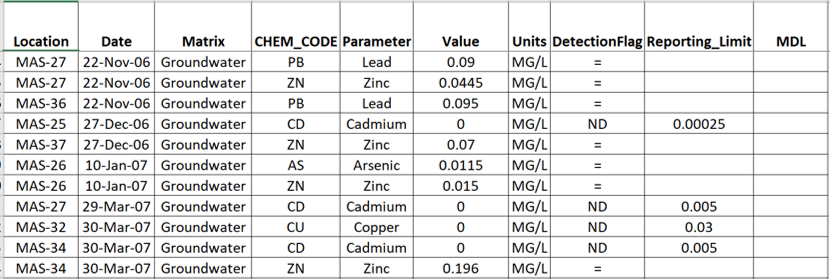

# Introduction
This is an anonymous data exploration application. 
It is designed to do basic analysis and visualization of environmental, censored datasets.

# Purpose

* This app is hosted on the secure R Shinyapps.io server at https://peernisse/shinyapps.io/dataExplore/.
* If you have R installed and use R, you can download this app from https://github.com/peernisse/dataExplore/
* The data to be analyzed must be in a `.csv` file in a local directory.
* The data are not transfered to the app server to preserve data security.

## Data Input Format
The data `.csv` file should contain the following columns, additional columns are ignored for analysis:

Column Name                |Description
:--------------------------|:------------------------------------------
**Location**|Character field of location names
**Matrix**|Field containing the matrix for the record (groundwater, air, soil, etc.)
**Date**|Date or text, format should be `'DD-MMM-YY'`, strings will be converted to dates
**Parameter**|Text column of parameters, spelled as desired on plots/tables etc.
**Value**|Results field, usually numeric, will be coerced to numeric
**Units**|A field of units abbreviations e.g., `'mg/l'`
**DetectionFlag**|Flag field, non-detects should be flagged as `'ND'`
**Reporting_Limit**|Field with he lab reporting limit, used in non-detect substitution
**MDL**|Method detection limit, used for non-detect substitution id RL is missing

## Data Source
How you get your data into the input format is up to you.

**Figure 1.** Screenshot of valid data `.csv` file.

</img>

